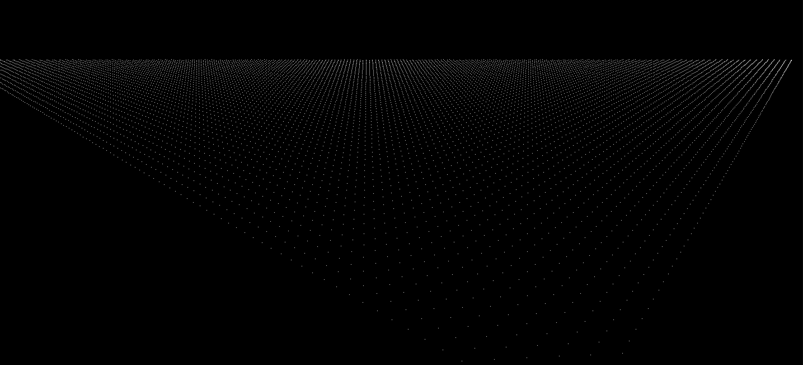

## Title:
 
Terrain Generation and Exploration (Including Heightmaps, Lighting, Bilinear Interpolation, Skycube, Texture Sampling)
 
## Video:
 
https://www.youtube.com/watch?v=Drsqm0ZTXW4

## Overview:

This is a final project for my Computer Graphics course and represents a culmination of the skills I learned during the course. This project utilizes OpenGL and C++. First, I generated a plane of vertices and applied a height-map to the vertices to increase or decrease their y-value. Then, I created quads made of two triangles for every 4 vertices. From here, I applied multitexturing based on y-value to create a realistic gradiant of water, to grass, to rock, to snow. Then, I implemented a skybox to surround the terrain and created a light to rotate around the scene simulating the sun. Lastly, I utilized bilenear interpolation to hold the camera to the scene and simulate a person walking on the jagged terrain.
 
## Screenshots

<b>Plane Generation</b>

<b>Height Map Applied With a Low FOV</b>

<b>Height Map Applied With a High FOV</b>

<b>Triangle Generation</b>

<b>Applying Colors based on Height</b>

<b>Missing Skycube: Held me up for hours. Can you see it?</b>

<b>Final Culmination</b>

